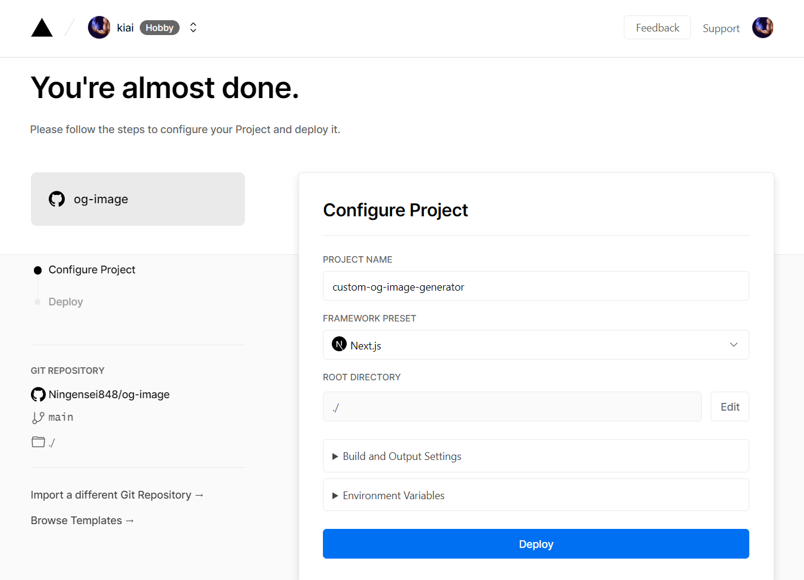

[](https://ningensei848.github.io/og-image/)

# [Open Graph Image as a Service](https://ningensei848.github.io/og-image/)

<a href="https://twitter.com/vercel">
    
</a>

Serverless service that generates dynamic Open Graph images that you can embed in your `<meta>` tags.

For each keystroke, headless chromium is used to render an HTML page and take a screenshot of the result which gets cached.

See the image embedded in the tweet for a real use case.

## What is an Open Graph Image?

Have you ever posted a hyperlink to Twitter, Facebook, or Slack and seen an image popup?
How did your social network know how to "unfurl" the URL and get an image?
The answer is in your `<head>`.

The [Open Graph protocol](http://ogp.me) says you can put a `<meta>` tag in the `<head>` of a webpage to define this image.

It looks like the following:

```html
<head>
  <title>Title</title>
  <meta property="og:image" content="http://example.com/logo.jpg" />
</head>
```

## Why use this service?

The short answer is that it would take a long time to painstakingly design an image for every single blog post and every single documentation page. And we don't want the exact same image for every blog post because that wouldn't make the article stand out when it was shared to Twitter.

That's where `custom-og-image-generator.vercel.app` comes in. We can simply pass the title of our blog post to our generator service and it will generate the image for us on the fly!

It looks like the following:

```html
<head>
  <title>Hello World</title>
  <meta property="og:image" content="https://custom-og-image-generator.vercel.app/api/**Hello**%20World.png" />
</head>
```

Now try changing the text `Hello%20World` to the title of your choosing and watch the magic happen ✨

## Deploy your own

<a href="https://vercel.com/new/git/external?repository-url=https://github.com/Ningensei848/og-image&project-name=og-image&repository-name=og-image">

</a>

_**Deploy the example using [Vercel](https://vercel.com?utm_source=github&utm_medium=readme).**_

<br />

You will see a screen similar to the following:

<br />

[](https://vercel.com/new/git/external?repository-url=https://github.com/Ningensei848/og-image&project-name=og-image&repository-name=og-image)

## How to use it?

### Get a static image

1. Go to [this page](https://custom-og-image-generator.vercel.app)
2. Fill in the form with the required information
3. Click on the image to copy its URL to the clipboard
4. Open a new tab, enter the URL, right-click on generated image and select 'Save As ...'

### Generate images dynamically

**Use the following URL as a base, and pass in the necessary query parameters.**

[https://custom-og-image-generator.vercel.app/api/`{{FILE_NAME}}`.png](https://custom-og-image-generator.vercel.app/api/`{{FILE_NAME}}`.png)

> `{{FILE_NAME}}.png` is interpreted as _**title**_ ([See also](#note))

<br />

### List of acceptable parameters

|     param |        type         | description              |
| --------: | :-----------------: | ------------------------ |
|  fileType |  `'png' \| 'jpeg'`  | (default is `png`)       |
|     theme | `'light' \| 'dark'` | (default is `light` )    |
|   _title_ |      `string`       | Refer to [`Note`](#note) |
| timestamp |      `string`       | :arrow_upper_right:      |
|      tags |     `string[]`      | :arrow_down_small:       |
| copyright |      `string`       | :arrow_double_down:      |
|      logo |      `string`       | :arrow_upper_left:       |
|    avater | `string` (URL only) | :arrow_lower_left:       |
|    author | `string` (URL only) | :arrow_lower_left:       |
|       aka |      `string`       | :arrow_lower_left:       |
|      site |      `string`       | :arrow_lower_right:      |

#### Note

- **_`title`_** is required if `{{FILE_NAME}}.png` is not specified
- If **both** `{{FILE_NAME}}.png` and `?title={{TITLE}}` specified, overwrite `{{FILE_NAME}}` with `{{TITLE}}`
  - `?title={{TITLE}}` is given priority over `{{FILE_NAME}}.png`

<br />

### Example

<details>
<summary>Learn more ...</summary>

##### `/` (App root)

- [https://example.vercel.app](https://custom-og-image-generator.vercel.app)
  - main page with default params
- [https://example.vercel.app/`?aka=@octocat`](https://custom-og-image-generator.vercel.app/?aka=@octocat)
  - with custom params (replace defaults)
- [https://example.vercel.app/`{{FILE_NAME}}`.png](https://custom-og-image-generator.vercel.app/{{FILE_NAME}}.png)
  - If you specify a static asset _**without parameters**_, an error will occur (404 Not Found)
  - This is so that the other static assets that make up the site are not recognized as parameters
- [https://example.vercel.app/`{{FILE_NAME}}`.png`?aka=@octocat`](https://custom-og-image-generator.vercel.app/{{FILE_NAME}}.png?aka=@octocat)
  - `{{FILE_NAME}}.png` is interpreted as `?title={{FILE_NAME}}`
  - redirect to [https://example.vercel.app/`?title={{FILE_NAME}}`&aka=@octocat](https://custom-og-image-generator.vercel.app/?title={{FILE_NAME}}&aka=@octocat)

##### `/api`

- [https://example.vercel.app/api/](https://custom-og-image-generator.vercel.app/api/)
  - redirect to main page with no param
- [https://example.vercel.app/api/`{{FILE_NAME}}`.png](https://custom-og-image-generator.vercel.app/api/{{FILE_NAME}}.png)
  - generated image
  - `{{FILE_NAME}}`.png is _mandatory_
- [https://example.vercel.app/api/`?title={{TITLE}}`](https://custom-og-image-generator.vercel.app/api/?title={{TITLE}})
  - redirect to [https://example.vercel.app/api/`{{TITLE}}`.png](https://custom-og-image-generator.vercel.app/api/{{TITLE}}.png)
- [https://example.vercel.app/api/`?aka=@octocat`](https://custom-og-image-generator.vercel.app/api/?aka=@octocat)
  - If neither `{{FILE_NAME}}`.png nor `?title={{TITLE}}` is specified, then redirect to main page (with params)
- [https://example.vercel.app/api/`{{FILE_NAME}}`.png`?title={{TITLE}}`](https://custom-og-image-generator.vercel.app/api/{{FILE_NAME}}.png?title={{TITLE}})
  - overwrite `{{FILE_NAME}}` with `{{TITLE}}`
  - redirect to [https://example.vercel.app/api/`{{TITLE}}`.png](https://custom-og-image-generator.vercel.app/api/{{TITLE}}.png)

</details>
<br />

## Author

[](https://twitter.com/Ningensei848)

[](mailto:k.kubokawa@klis.tsukuba.ac.jp)

## License

_This software is released under the [MIT License](LICENSE)._
